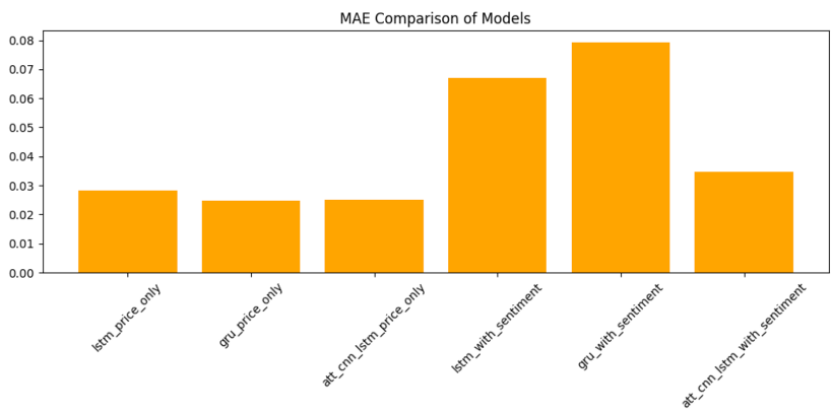
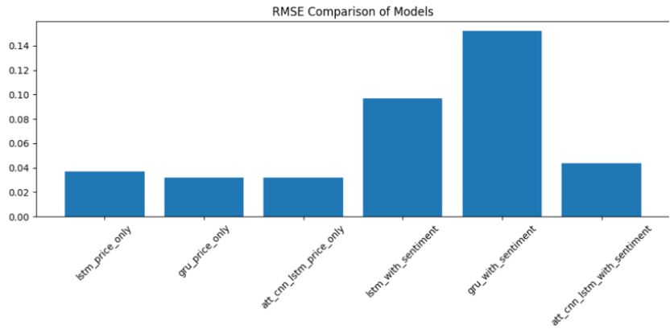
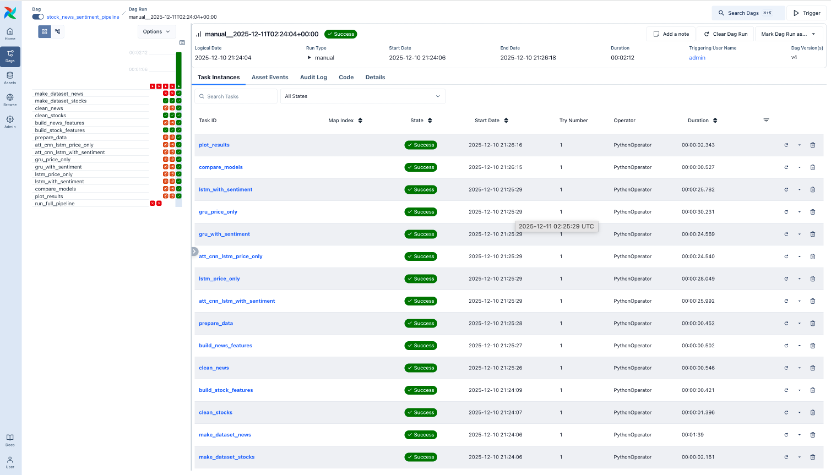
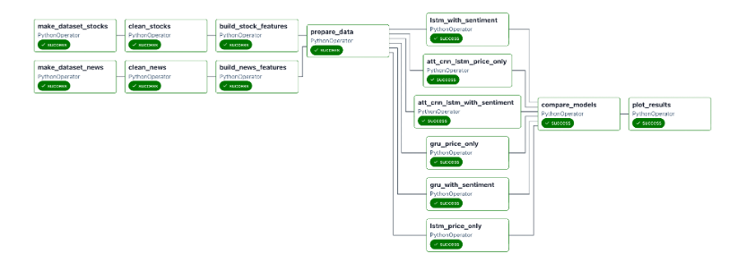

# 📈 AI Trader for Stock Price Prediction
*EECS6893 Big Data Analytics Final Project (Fall 2025)

*A full machine learning pipeline combining stock price data, news sentiment analysis, feature engineering, and deep learning models automated with Apache Airflow.*

## 🧭 Table of Contents
- [Project Overview](#project-overview)
- [1. Offline Pipeline (Local ML Workflow)](#1-offline-pipeline-local-ml-workflow)
  - [1.1 Data Collection](#11-data-collection)
  - [1.2 Data Cleaning](#12-data-cleaning)
  - [1.3 Feature Engineering](#13-feature-engineering)
  - [1.4 Modeling & Evaluation](#14-modeling--evaluation)
  - [1.5 Model Comparison & Visualization](#15-model-comparison--visualization)
- [2. Airflow Pipeline (Automation)](#2-airflow-pipeline-automation)
- [System Architecture](#system-architecture)
- [Project Structure](#project-structure)
- [Technologies Used](#technologies-used)
- [Run Locally](#run-locally)

# Project Overview
This project builds a complete offline machine learning workflow to forecast stock price movements using:

- Yahoo Finance (historical OHLCV data)  
- Alpha Vantage (news + raw sentiment feed)  
- FinBERT (sentiment analysis)  
- Deep Learning Models (LSTM, GRU, CNN-Attention)  
- Apache Airflow (pipeline automation)

Tickers analyzed:
```
AAPL, GOOG
Date Range: 2023-01-01 → 2025-12-09
```

# 1. Offline Pipeline (Local ML Workflow)

## 1.1 Data Collection
Scripts:
- make-dataset-stocks.py → downloads OHLCV from yfinance  
- make-dataset-news.py → downloads news from Alpha Vantage  

Outputs (data/raw/):
```
stocks.csv
news.csv
```

## 1.2 Data Cleaning
Scripts:
- clean-stocks.py
- clean-news.py

Outputs (data/clean/):
```
clean_stocks.csv
clean_news.csv
```

Cleaning includes:
- Normalize timestamps  
- Remove duplicates  
- Parse time_published → daily date  
- Normalize yfinance multilevel headers  

## 1.3 Feature Engineering
Scripts:
- build-stock-features.py
- build-news-features.py

Outputs (data/features/):
- price_only_features.csv
- price_sentiment_features.csv

Generated features:
- Lag returns  
- Rolling mean  
- Rolling volatility  
- Technical indicators  
- FinBERT sentiment alignment  

## 1.4 Modeling & Evaluation
Located in models/.

Baseline Models:
- 00_prepare_data.py  
- 00_baseline_moving_average.py  
- 00_baseline_xgboost.py  

Deep Learning — Price Only:
- 01_lstm_price_only.py  
- 02_gru_price_only.py  
- 03_att_cnn_lstm_price_only.py  

Deep Learning — With Sentiment:
- 04_lstm_with_sentiment.py  
- 05_gru_with_sentiment.py  
- 06_att_cnn_lstm_with_sentiment.py  

## 1.5 Model Comparison & Visualization
Scripts:
- compare_models.py
- plot_results.py

Outputs (outputs/):
- metrics.csv  
- model_performance_plots/  





# 2. Airflow Pipeline (Automation)
Airflow orchestrates the workflow:

1. Download stock + news data  
2. Clean datasets  
3. Build stock & sentiment features  
4. Train all 6 deep learning models  
5. Evaluate & save best_model.h5  
6. Export metrics + plots  




# System Architecture
```
      Data Collection
    (Yahoo + Alpha Vantage)
              ↓
        Data Cleaning
              ↓
     Feature Engineering
              ↓
      Model Training (6 models)
              ↓
   Model Comparison + Metrics
              ↓
          Airflow DAG
              ↓
      outputs/ (metrics, plots)
```

# Project Structure
```
project/
├── data/
│   ├── raw/
│   ├── clean/
│   └── features/
├── src/
│   ├── 0-data/
│   ├── 1-cleaning/
│   ├── 2-features/
├── models/
│   ├── 00_prepare_data.py
│   ├── 01_lstm_price_only.py
│   └── ...
├── outputs/
│   ├── metrics.csv
│   ├── plots/
├── airflow_home/
└── stock_news_sentiment_pipeline.py
```

# Technologies Used
- yfinance  
- Alpha Vantage API  
- pandas / numpy  
- FinBERT  
- TensorFlow / Keras  
- Apache Airflow  

# Run Locally
## Install dependencies
```
pip install -r requirements.txt
```

## Run pipeline
```
python stock_news_sentiment_pipeline.py
```

## Start Airflow
```
airflow standalone
```
